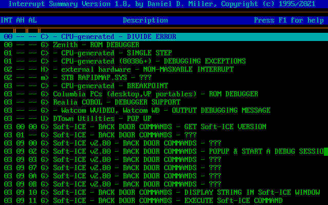
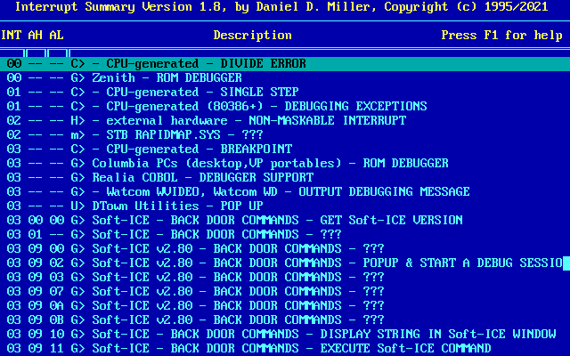

# IntSum

## About

IntSum is a lightweight text-mode MS-DOS program for viewing
[Ralf Brown's Interrupt List](http://www.cs.cmu.edu/~ralf/files.html) (RBIL).
It was originally written by Daniel D. Miller in 1995/1996 and distributed as
part of `inter61e.zip` ("utility programs").

This is an updated version by Robert Riebisch.

For documentation see [`SRC/INTSUM.TXT`](src/INTSUM.TXT).

For changes see [`SRC/INTSUM.REV`](src/INTSUM.REV).

## Screenshots

### Default colors

### NC 3.0-inspired colors

